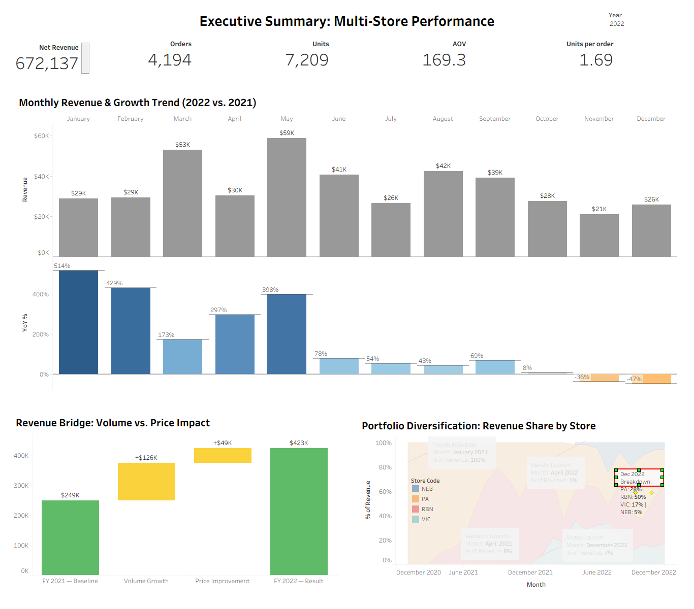

# Portfolio Diversification & Scaling: FY 2022 Growth Mechanics Analysis

> **Interactive Dashboard:** [View Live on Tableau Public](https://public.tableau.com/app/profile/luis.jordan.franco/viz/executive-summary/Dashboard1)

> 📄 **Full Analysis:** [Read the Business Memo — Growth Mechanics & Strategic Recommendations](docs/business_memo.md)

| FY 2022 KPI | Value |
| :--- | :--- |
| **Net Revenue** | $423,429 |
| **Total Orders** | 2,521 |
| **Active Brands** | 4 (PA, RBN, VIC, NEB) |
| **PA Revenue Share (Dec 2022)** | 28% — down from 100% in 2020 |

---

## Business Context: The "Single-Brand" Risk

By the close of 2021, the Rabbona Group had built a successful e-commerce operation, yet one with a critical structural flaw: **nearly 90% of all revenue was concentrated in a single legacy brand (Pasión Albiverde)**. The business was profitable, but fragile — one bad season or one algorithmic shift in the PA fan base could wipe out the majority of revenue overnight.

The 2022 roadmap was designed to directly address this vulnerability. New storefronts were launched targeting adjacent fandoms: **Rabbona (Global Soccer)** and **Victus (Sports Lifestyle)**. The question was not just *whether* they could generate revenue — but *whether* the core operational model was truly replicable across different audiences at scale.

---

## The Objective

To perform a rigorous **FY 2022 Performance Review** for the consolidated "Rabbona Group" portfolio, with two analytical goals:

1. **Diagnose the Growth Engine:** Isolate whether revenue growth was driven by **Volume (Order Count)** or **Price (AOV)** — a distinction with major strategic implications for how to scale next.
2. **Validate the Diversification Hypothesis:** Determine whether the new storefronts (RBN, VIC) had achieved meaningful, self-sustaining revenue share by year-end, successfully reducing single-brand dependency.

---

## The Challenge

Answering these questions required solving a significant **data engineering problem first**.

Each of the 4 WooCommerce stores lived in its own isolated database with a different schema structure, no shared customer identifiers, and no unified date taxonomy. There was no single place to see portfolio-level performance.

Before any analysis could begin, we had to **build the infrastructure** to make it possible:

- Design and implement a **Star Schema Data Warehouse** (MariaDB) to consolidate all stores.
- Engineer a **SQL View Layer** (`vw_kpi_daily_store`) to pre-aggregate daily metrics per store, reducing downstream processing load by ~40%.
- Define a canonical data model with `fact_orders`, `fact_order_items`, `dim_store`, `dim_product`, and `dim_date` tables.

---

## Key Findings

### 1. The Growth Engine Is Volume, Not Price

The Revenue Bridge Analysis isolates the two drivers of revenue variance:

- **Finding:** 72% of positive revenue variance in FY 2022 was attributable to an increase in **transaction volume** (+848 orders), while price (AOV) accounted for the remaining 28% (+$49K).
- **Implication:** The market is responding to product-market fit, not to price. This validates the customer acquisition strategy, but also surfaces the next-phase opportunity: if demand is this strong, there is room to test **price elasticity** on top-performing SKUs without sacrificing volume.

### 2. The Diversification Hypothesis: Validated

The "Revenue Share" area chart tells the story clearly:

- **Q1 2021:** Pasión Albiverde accounted for approximately 90% of daily revenue.
- **Q4 2022:** The portfolio had shifted to a balanced ecosystem, with RBN and VIC commanding a combined ~42% of revenue.
- **Conclusion:** The multi-brand model is not only viable — it is stable. Operational risk is now distributed across multiple revenue streams.

---

## Data Architecture

To enable this analysis, a consolidated **Star Schema** was engineered in MariaDB, unifying transaction logs from 4 isolated WooCommerce databases.

*(Entity Relationship Diagram — Star Schema Design)*

| Layer | Object | Description |
| :--- | :--- | :--- |
| **Staging** | `stg_orders`, `stg_order_items` | Raw ingestion layer from each WooCommerce DB |
| **Dimensions** | `dim_store`, `dim_product`, `dim_date` | Conformed dimensions for cross-store analysis |
| **Facts** | `fact_orders`, `fact_order_items` | Grain: order-level and line-item-level |
| **View Layer** | `vw_kpi_daily_store` | Pre-aggregated daily KPIs per store for Tableau |

---

## Technical Stack

- **Database Engine:** MariaDB (Hosted on Hostinger VPS)
- **Visualization:** Tableau Desktop
- **Data Modeling:** SQL (Star Schema, Window Functions, CTEs)
- **Tools:** DBeaver, VS Code

---

## Repository Structure

- `sql/01_schema_setup.sql`: Full DDL for the Star Schema (staging, dimensions, facts).
- `sql/02_analytical_views.sql`: View layer for Tableau consumption.
- `sql/03_data_quality_tests.sql`: Validation queries to ensure data integrity.
- `docs/business_memo.md`: Full business analysis, strategic insights and recommendations.
- `assets/`: Dashboard preview and ERD diagram.
- `dashboard/`: Packaged Tableau workbook (`.twbx`).

---

**Author:** Luis Fernando Jordan
[LinkedIn](https://www.linkedin.com/in/luis-fernando-jordan/) | [Portfolio](https://luisfernandojordan.com)
