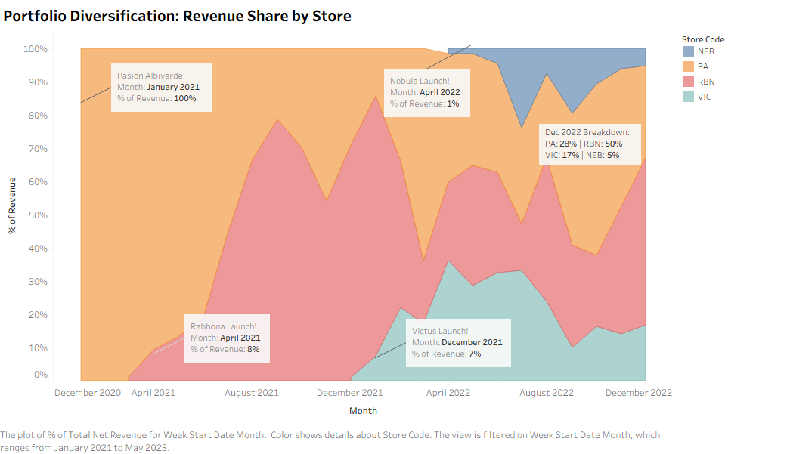
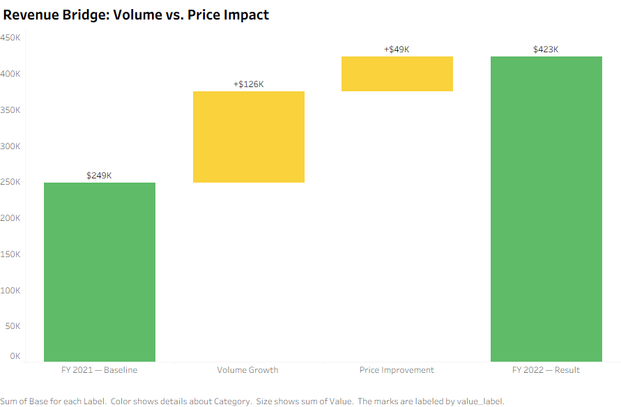
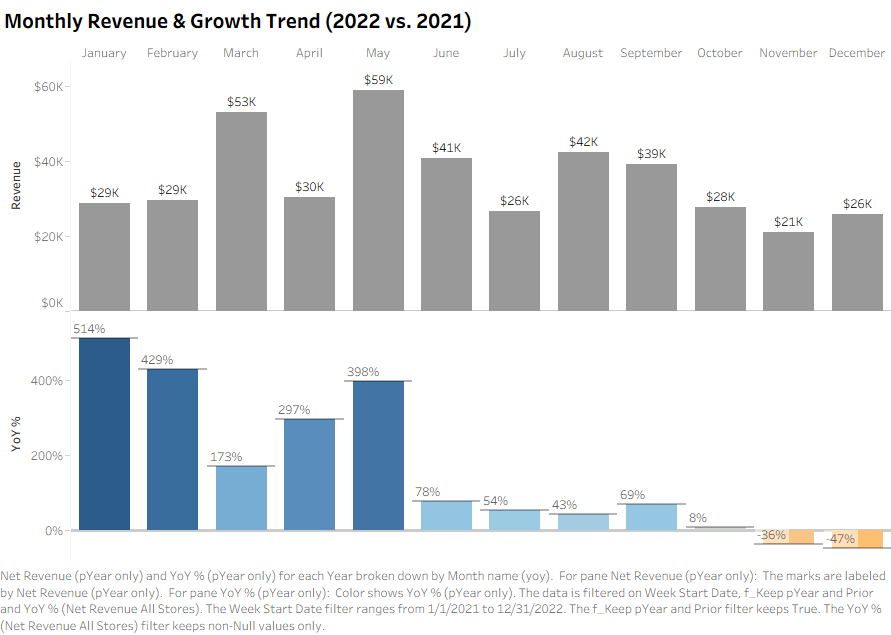

# Business Memo: FY 2022 Portfolio Performance Review

**To:** Key Stakeholders — Rabbona Group  
**From:** Luis Fernando Jordan, Data Analyst  
**Date:** January 2023  
**Subject:** FY 2022 Growth Mechanics & Portfolio Diversification — Final Analysis

---

---

## 1. Executive Summary

In FY 2022, the consolidated Rabbona Group portfolio generated **$423,429 in Net Revenue** across **2,521 orders** from 4 active storefronts. This year represents a structural turning point: for the first time, **no single brand accounted for more than 37% of total revenue**, a dramatic shift from the near-total dependency on Pasión Albiverde that defined 2020.

**Two critical findings shape the strategic posture for 2023:**

1. **Revenue growth is volume-driven, not price-driven.** Transaction volume increased +51% YoY, while AOV remained essentially flat. This validates product-market fit but signals that pricing power has not yet been activated.
2. **The multi-brand diversification hypothesis is validated.** By Q4 2022, three brands (PA, RBN, VIC) were generating meaningful, self-sustaining revenue — reducing single-brand operational risk from 100% to 37%.

---

## 2. Historical Context: From Monoculture to Ecosystem

To appreciate the 2022 results, the baseline must be established clearly.

| Year | PA | RBN | VIC | NEB | **Total** |
| :--- | :--- | :--- | :--- | :--- | :--- |
| **2020** | $117,355 (100%) | — | — | — | **$117,355** |
| **2021** | $126,269 (51%) | $122,040 (49%) | $399 (<1%) | — | **$248,708** |
| **2022** | $156,471 (37%) | $147,321 (35%) | $93,457 (22%) | $26,179 (6%) | **$423,428** |

*Chart: Revenue share shift from single-brand dependency (2020) to a balanced 4-brand ecosystem (2022).*

**The pivotal insight:** In 2020, a total failure of Pasión Albiverde would have meant a 100% revenue loss. By the end of 2022, that same scenario would leave the business with **$266,957 in annual revenue** from three other brands still standing. That is what de-risking an operation looks like in practice.

---

## 3. Growth Mechanics: Volume Is the Engine

### Revenue Bridge: 2021 → 2022

The Revenue Bridge below decomposes the +$174,720 (+70%) growth from 2021 to 2022 into its two root causes: Volume and Price.

*Chart: Waterfall decomposition of revenue variance — Volume impact vs. Price (AOV) impact.*

| Driver | Impact | Interpretation |
| :--- | :--- | :--- |
| **Volume** (+848 orders) | +$126K | Customer acquisition and new brand growth. Primary engine (72% of total growth). |
| **Price** (AOV +$19) | +$49K | AOV grew from $149 to $168. Meaningful contribution (28%) — not negligible. |

**Strategic implication:** The business is in "land and expand" mode — growing the customer base across new niches without yet leveraging its pricing power. This is the right sequence: establish brand loyalty first, optimize margins second.

---

## 4. Monthly Performance Trend

*Chart: Monthly net revenue per store (2022). Identifies seasonal peaks, Q2 surge, and new store launch cadence.*

Key observations from the monthly trend:

- **Q2 (April–June)** shows the clearest volume spike, particularly for RBN — driven by international football season alignment.
- **VIC shows consistent month-over-month growth** throughout the year, confirming accelerating brand awareness.
- **NEB's launch in Q3** visibly adds a new revenue layer without cannibalizing existing stores.

---

## 5. Store-Level Deep Dive

### Pasión Albiverde (PA) — The Anchor

- **2022 Revenue:** $156,471 | **Orders:** 1,069 | **Est. AOV:** ~$146
- PA's revenue grew +24% YoY in absolute terms, but its revenue share declined from 51% to 37%.
- **Assessment:** This is healthy maturation. PA continues compounding while no longer acting as a ceiling for the group. Its loyal, high-LTV customer base remains the financial bedrock of the portfolio.

### Rabbona (RBN) — The Challenger

- **2022 Revenue:** $147,321 | **Orders:** 879 | **Est. AOV:** ~$168
- RBN launched in 2021 and grew +21% in its first full operating year. It has the second-highest AOV in the portfolio.
- **Assessment:** The global soccer audience demonstrates stronger purchasing power than the local market. RBN positions itself as the premium alternative within the ecosystem.

### Victus (VIC) — The Breakout Story

- **2022 Revenue:** $93,457 | **Orders:** 446 | **Est. AOV:** ~$209
- From a near-zero presence in 2021 ($399 in a single test transaction), VIC became a **$93K business in its first real year of operation**.
- **Assessment:** VIC commands the highest AOV in the portfolio at ~$209, suggesting the sports lifestyle customer spends more per transaction. This is the highest-potential brand for margin optimization in 2023.

### Nebula (NEB) — The New Entry

- **2022 Revenue:** $26,179 | **Orders:** 127 | **Est. AOV:** ~$206
- NEB entered in Q3 2022 and immediately achieved a profitable first quarter, confirming that the Rabbona Group's operational model is now fully replicable.
- **Assessment:** The ~$206 AOV rivals VIC, indicating strong product-market fit in the pop culture segment. Watch Q1-Q2 2023 closely as this brand establishes its seasonal rhythm.

---

## 6. Recommendations for 2023

### Priority 1 — Proportional Effort Allocation (PA Must Not Be Neglected)

Diversification was necessary and validated. However, diversification must not translate into equal distribution of time and marketing investment across all brands. **The data is clear about which brand generates the most total lifetime value: Pasión Albiverde.**

The risk of building a multi-brand ecosystem is that the anchor loses momentum precisely because team attention gets spread too thin. In 2022, PA grew in absolute terms (+24%), but it is worth monitoring whether that growth rate would have been higher with undivided focus.

**Recommendation:** Define a formal **budget and effort allocation model** based on trailing revenue share. PA, RBN, and VIC should receive resources proportional to their contribution — not equal slices. Brands at early stage (NEB) should receive visibility investment, but not at the expense of proven performers.

### Priority 2 — Price Elasticity Testing (RBN & VIC)

Both RBN and VIC command the highest AOVs in the portfolio ($168 and $209 respectively) and their audiences have demonstrated willingness to pay in a competitive global market. Given the in-house production model (Print-on-Demand with fixed material cost per unit), any price increase flows almost entirely to margin.

**Recommendation:** Test a 5–10% price increase on the top 3–5 SKUs per brand over 60 days. Measure conversion rate impact before committing portfolio-wide. If volume holds within 5% of baseline, the margin improvement is structural and permanent.

---

## 7. Data Methodology

This analysis was built on a **Star Schema data warehouse** (MariaDB, hosted on Hostinger VPS), consolidating raw WooCommerce transaction data from 4 independent databases into a unified analytical layer.

| Layer | Object | Purpose |
| :--- | :--- | :--- |
| Staging | `stg_orders`, `stg_order_items` | Raw ingestion from source WooCommerce DBs |
| Dimensions | `dim_store`, `dim_product`, `dim_date` | Conformed dimensions for cross-store analysis |
| Facts | `fact_orders`, `fact_order_items` | Order-level and line-item-level granularity |
| Analytical Views | `vw_kpi_daily_store`, `vw_kpi_store_summary` | Pre-aggregated KPIs consumed by Tableau |

All figures in this memo reflect **completed, paid orders only**. Cancelled, refunded, and pending orders were excluded from all calculations.

---

*Full interactive dashboard available on [Tableau Public](https://public.tableau.com/app/profile/luis.jordan.franco/viz/executive-summary/Dashboard1).*
